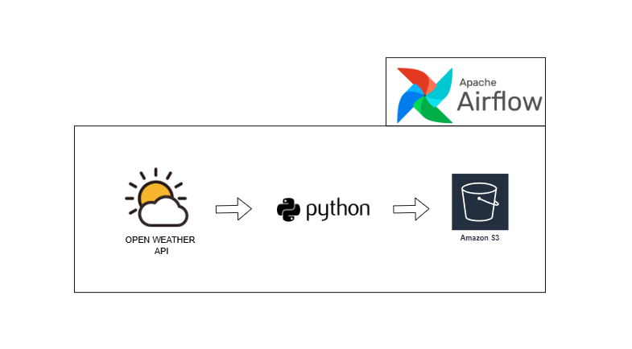

# Open Weather ETL Pipeline

## Overview

This project implements an ETL (Extract, Transform, Load) pipeline using Apache Airflow to automate the process of fetching weather data from the Open Weather API, transforming it using Python, and storing the processed data into an Amazon S3 bucket. 
The ETL pipeline is designed to run daily, ensuring that the latest weather data is consistently available for analysis and reporting.



## Project Structure

- `weather-dag.py`: The main DAG (Directed Acyclic Graph) script for Apache Airflow.
- `Sample Output - current_weather_data_Boston_18072024040400.csv`: Sample output data file containing weather information.
- `weather-etl-workflow.png`: Diagram illustrating the ETL workflow.

## Prerequisites

- Apache Airflow
- Python 3.x
- Pandas
- Open Weather API key
- AWS credentials (with access to S3)

## Setup Instructions

1. Clone the repository:
    ```bash
    git clone https://github.com/yourusername/open-weather-etl-pipeline.git
    cd open-weather-etl-pipeline
    ```
2. Install required Python packages:
    ```bash
    pip install pandas apache-airflow[http]
    ```
3. Configure Airflow and AWS credentials.

## Running the ETL Pipeline

1. Start the Airflow web server and scheduler.
2. Trigger the DAG via the Airflow web interface.

#
